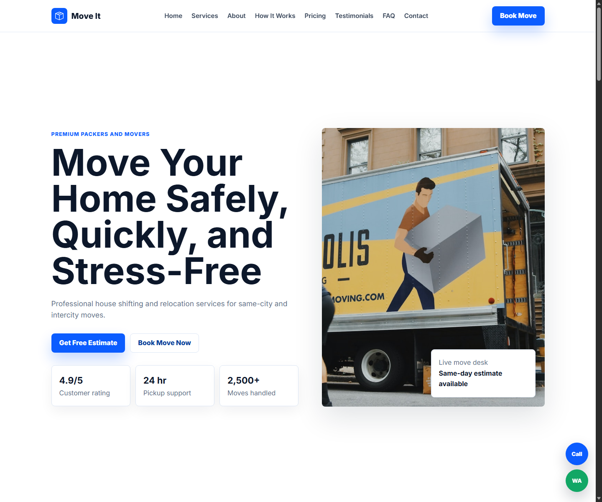

# Move It - Premium Moving Service Website

Move It is a modern, responsive website for a professional house shifting and relocation service. It is built as a clean static site for GitHub Pages, Vercel, or any simple web hosting platform.



## Live Preview

Add your deployed URL here:

```text
https://your-domain.com/
```

## Features

- Premium logistics and movers landing page
- Sticky responsive navbar with mobile menu
- Hero section with clear service positioning
- Services section for same-city moving, intercity relocation, office shifting, packing, furniture, vehicle transport, loading, and unloading
- Trust-building highlights
- How-it-works timeline
- Pricing / estimate cards
- Booking estimate form with validation
- Contact form with toast message
- FAQ accordion
- WhatsApp and call action buttons
- Scroll-to-top button
- SEO meta tags, Open Graph tags, `robots.txt`, and `sitemap.xml`
- Fully responsive mobile-first layout

## Screenshots

### Desktop


### Mobile


## Tech Stack

- HTML5
- CSS3
- Vanilla JavaScript
- Static assets

## Folder Structure

```text
Move-It-Website/
├── index.html
├── style.css
├── script.js
├── robots.txt
├── sitemap.xml
├── website-text.txt
├── screenshots/
│   ├── home-desktop.png
│   └── home-mobile.png
├── box-seam.svg
├── briefcase.svg
├── bus-front.svg
├── chat-square-heart.svg
├── chevron-right.svg
├── moving-van.jpg
├── family.jpg
├── couple.jpg
└── dog.jpg
```

## Run Locally

Open `index.html` directly in your browser.

For a local server, you can also run:

```bash
npx serve .
```

## Deployment

This project is ready for:

- GitHub Pages
- Vercel
- Netlify
- Any static hosting provider

Before production, update these placeholder URLs:

- `index.html` Open Graph URL and image URL
- `robots.txt` sitemap URL
- `sitemap.xml` site URL

## Developer

Developed by **Arman**.
